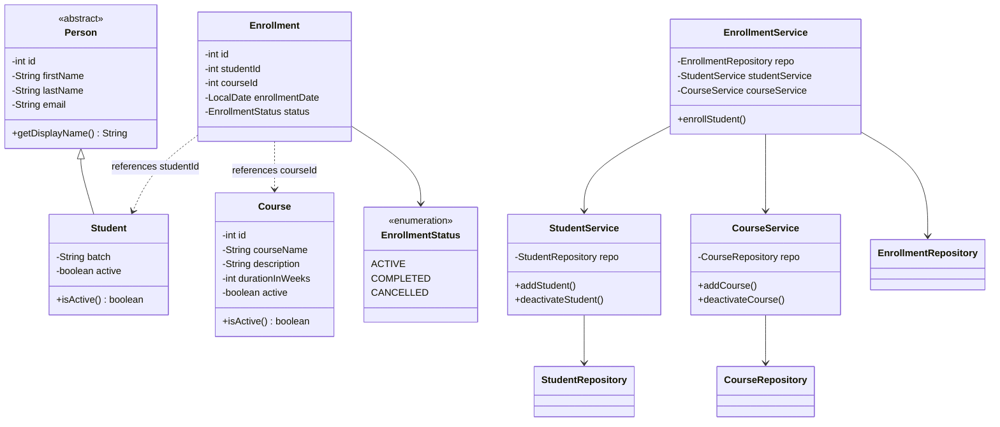

# LearnTrack - Student & Course Management System

LearnTrack is a Core Java console application for managing students, courses, and enrollments.

## Features
- **Student Management**: Add, view, search, and deactivate students.
- **Course Management**: Add, view, and deactivate courses.
- **Enrollment Management**: Enroll students in courses and track status.

## Directory Structure
- `src/com/airtribe/learntrack`: Source code.
  - `entity`: Data models (Person, Student, Course, Enrollment).
  - `service`: Business logic.
  - `repository`: In-memory storage.
  - `exception`: Custom exceptions.
  - `util`: Helper classes.
- `docs`: Documentation and design notes.

## Class Diagram

## How to Run
1. Compile: `javac -d bin -sourcepath src src/com/airtribe/learntrack/Main.java`
2. Run: `java -cp bin com.airtribe.learntrack.Main`

